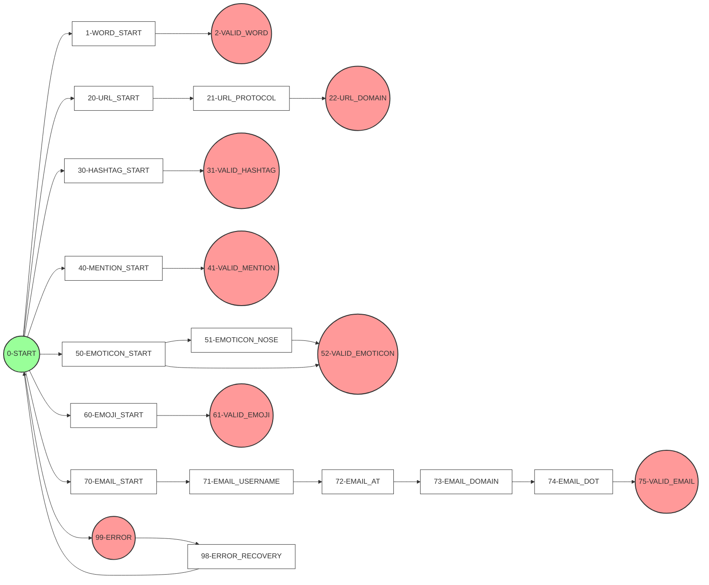

# TokenMate - Web Finite Automata Tokenizer

<div align="center">
  
  <p><em>State-of-the-art text tokenization powered by Finite Automata Theory</em></p>
</div>

## 🎯 Overview

TokenMate is a modern and sophisticated web-based tokenizer that leverages deterministic finite automata to provide precise token recognition with explicit state transitions. Perfect for processing modern web content and structured text analysis.

## ⚡ Key Features

- **Pattern Recognition**: Processes words, phrases, and sentences using state-based transitions
- **URL Detection**: Identifies and validates web URLs and domain patterns
- **Social Media Content**: Recognizes hashtags, mentions, and modern web content
- **Email Validation**: Validates email addresses through multi-state transitions
- **Unicode & Emoticons**: Processes emoji codes and ASCII emoticons accurately

## 🔧 Technical Implementation

TokenMate uses a sophisticated state machine with:
- Deterministic Finite Automata (DFA) for token processing
- Real-time state transitions
- Pattern matching with explicit state sequences
- Support for Unicode characters and special sequences

## 🎨 Token Types

- URLs (states: 20-22)
- Hashtags (states: 30-31)
- Mentions (states: 40-41)
- Emoticons (states: 50-52)
- Emoji Unicode (states: 61)
- Email Addresses (states: 70-75)

## 🚀 Getting Started

1. Clone the repository
2. Install dependencies:
```bash
npm install
```

3. Start the development server:
```bash
npm run dev
```

4. Open your browser to `http://localhost:5173`

## 📝 Usage Examples

```javascript
// Basic token recognition
const tokenizer = new TokenMate();
const result = tokenizer.analyze("Check out https://example.com! #awesome @user 😊");

// Output:
// {
//   urls: ["https://example.com"],
//   hashtags: ["#awesome"],
//   mentions: ["@user"],
//   emojis: ["😊"]
// }
```

## 🔄 State Transition Examples



## 🧪 Running Tests

```bash
npm run test
```

## 🛠️ Development

### Prerequisites
- Node.js (v16 or higher)
- npm (v8 or higher)

### Project Structure
```
TokenMate/
├── src/
│   ├── components/
│   ├── hooks/
│   ├── router/
│   ├── context/
│   ├── utils/
│   └── assets/
└── configs
```

## 🤝 Contributing

1. Fork the repository
2. Create your feature branch (`git checkout -b feature/AmazingFeature`)
3. Commit your changes (`git commit -m 'Add some AmazingFeature'`)
4. Push to the branch (`git push origin feature/AmazingFeature`)
5. Open a Pull Request

## 📈 State Diagram

For a detailed view of the state transitions, check out our [JFLAP State Diagram](public/automata/Final%20FA%20Automata.jff).

## 👥 Authors

- Alfred Nodado - *Full-Stack Developer* - [@Auguzcht](https://github.com/Auguzcht)
- Joshua Famor - *Model Architect* - [@Joshieww](https://github.com/Joshieww)
- Hanna Sato - *Researcher* - [@HSatsss](https://github.com/HSatsss)

## 🙏 Acknowledgments

- Automata Theory principles and implementation guidance
- React and modern web development community
- Contributors and testers